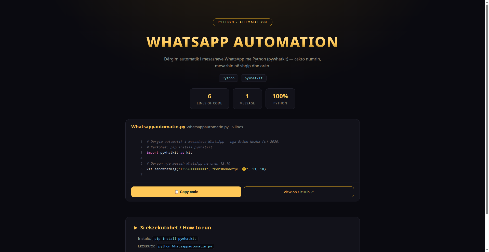

# 💬 Whatsapp Automation 🇦🇱

> Dërgim automatik i mesazheve WhatsApp me Python (pywhatkit) — cakto numrin, mesazhin në shqip dhe orën.



**🔴 Live demo — shiko kodin:** https://erionnezha.github.io/Whatsapp-Automation/


## ⚙️ Konfigurimi

Ndrysho në `Whatsappautomatin.py`:
- numrin e telefonit (format ndërkombëtar)
- tekstin e mesazhit
- orën dhe minutën e dërgimit

## ▶️ Si ekzekutohet

```bash
pip install pywhatkit
python Whatsappautomatin.py
```

## 📄 Licenca

Copyright © 2026 Erion Nezha. Të gjitha të drejtat të rezervuara. Shiko [LICENSE](LICENSE).

---

# 💬 Whatsapp Automation 🇬🇧

> Automatic WhatsApp messaging with Python (pywhatkit) — schedule the number, the Albanian message and the time.

**🔴 Live demo — view the code:** https://erionnezha.github.io/Whatsapp-Automation/


## ⚙️ Configuration

Edit in `Whatsappautomatin.py`:
- the phone number (international format)
- the message text
- the sending hour and minute

## ▶️ How to run

```bash
pip install pywhatkit
python Whatsappautomatin.py
```

## 📄 License

Copyright © 2026 Erion Nezha. All rights reserved. See [LICENSE](LICENSE).
